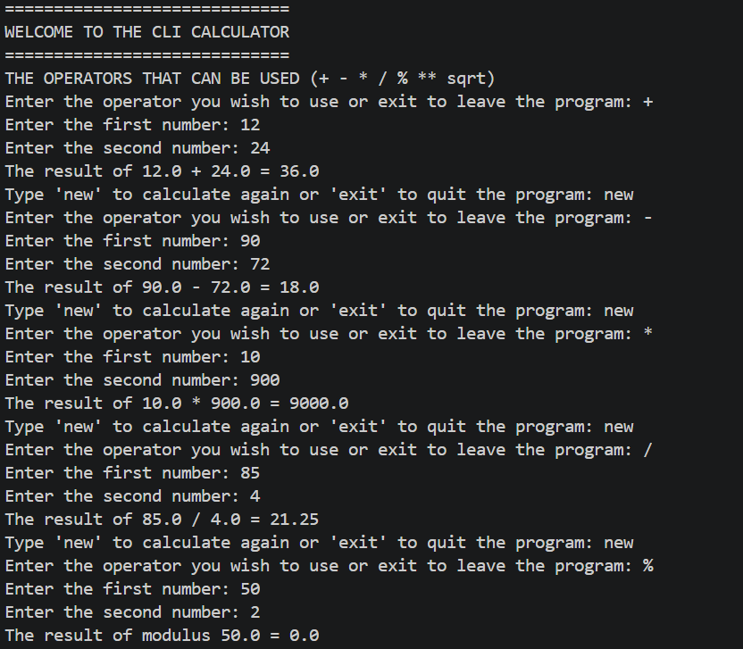
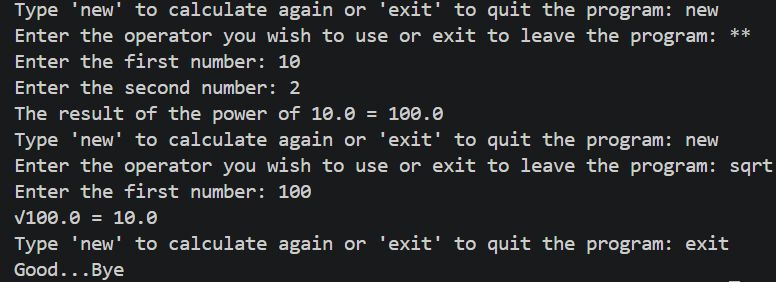

# Python Command Line Interface Calculator

## Brief Description

A CLI Calculator built for developers, IT and Computer Science students, and anyone who works in the terminal daily. Instead of switching to a phone or another application mid-workflow, this calculator lives exactly where you already are.

## What this program does

A Python program that runs in the terminal, asks the user to enter two numbers and an operator, performs the calculation, displays the result, and loops so the user can keep calculating without restarting.

## Operators Supported
A Total of 7 operators can be used in this CLI Calculator: 
- '+' Addition
- '-' Subtraction 
- '*' Multiplication
- '/' Division
- '%' Modulus (remainder)
- '**' Power/Exponent
- 'sqrt' Square Root

## How to Run
** Requirements:** Python 3 Installed on your machine.

**Step 1** : Clone your repository:
bash git clone https://github.com/GeekOryan/cli-calculator.git

**Step 2**: Navigate into the folder:
bash
cd cli-calculator

**Step 3**: Run the program:
bash
python calculator.py

## Screenshot

## Technology Used
- Python 3
- Math module (built-in)
